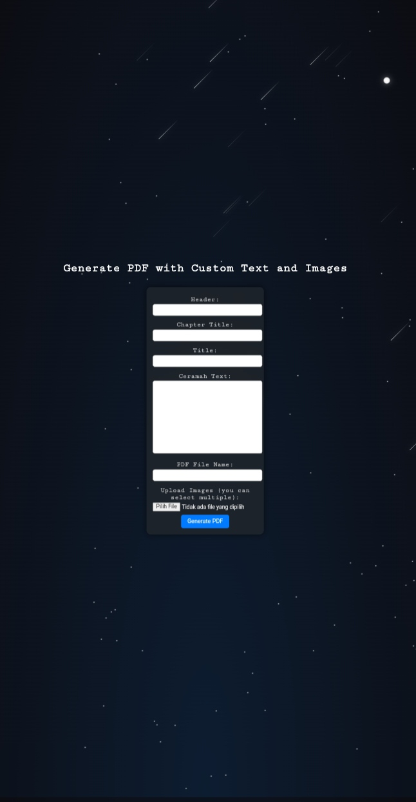

- 👋 Hi, I’m @n10XBi
- 👀 I’m interested in ...
- 🌱 I’m currently learning ...
- 💞️ I’m looking to collaborate on ...
- 📫 How to reach me ...
- 😄 Pronouns: ...
- ⚡ Fun fact: ...


# PDF Generator with Custom Text and Images

Welcome to the **PDF Generator** application! This project allows you to generate a PDF with custom Arabic text, images, and dynamic headers and chapter titles. Created with love by **Genta Developer**, this app leverages Python's Flask framework and the FPDF library to create beautifully formatted PDF documents. 

## Features

- **Customizable Headers**: Set your own headers for each page.
- **Dynamic Chapter Titles**: Specify chapter titles for different sections.
- **Arabic Text Support**: Seamlessly handle Arabic text with proper shaping and directionality.
- **Image Integration**: Insert multiple images at specified placeholders within the text.
- **User-friendly Interface**: A simple web form to input your data and generate the PDF.

## How to Use

### Prerequisites

Ensure you have the following installed:

- Python 3.7+
- Flask
- FPDF
- arabic_reshaper
- python-bidi
- Pillow

You can install the required Python packages using:

```sh
pip install flask fpdf arabic-reshaper python-bidi pillow
```

### Installation

1. **Clone the Repository**

    ```sh
    git clone https://github.com/n10XBi/PDF-CREATOR-FLASK.git
    cd pdf-generator
    ```

2. **Add the Amiri Font**

    Download the [Amiri font](https://www.amirifont.org/) and place the `Amiri-Regular.ttf` file in the `static` directory.

### Running the Application

Start the Flask application:

```sh
python app.py
```

Open your web browser and navigate to `http://127.0.0.1:5000/`.

### Using the Application

1. **Enter Header**: Specify the header text that will appear at the top of each page.
2. **Enter Chapter Title**: Provide the chapter title for the section.
3. **Enter Title**: Input the main title of your document.
4. **Enter Text**: Write or paste your Arabic text. Use `{{image}}` as a placeholder where you want to insert images.
5. **Set File Name**: Choose a name for your PDF file.
6. **Upload Images**: Upload one or more images to be inserted at the placeholders.
7. **Generate PDF**: Click the "Generate PDF" button to create and download your customized PDF.

## Example



## Contributing

Contributions are welcome! If you have any suggestions or improvements, feel free to open an issue or submit a pull request.

1. Fork the repository
2. Create your feature branch (`git checkout -b feature/awesome-feature`)
3. Commit your changes (`git commit -am 'Add some awesome feature'`)
4. Push to the branch (`git push origin feature/awesome-feature`)
5. Create a new Pull Request

## License

This project is licensed under the MIT License - see the [LICENSE](LICENSE) file for details.

## Contact

Created by **Genta Developer**. If you have any questions or feedback, feel free to reach out!

---

Enjoy generating your custom PDFs! 🚀
